# Jobtrack

Tablero gamificado para registrar ofertas de empleo, seguir su avance y mantener
la informacion sincronizada entre la computadora y el telefono.

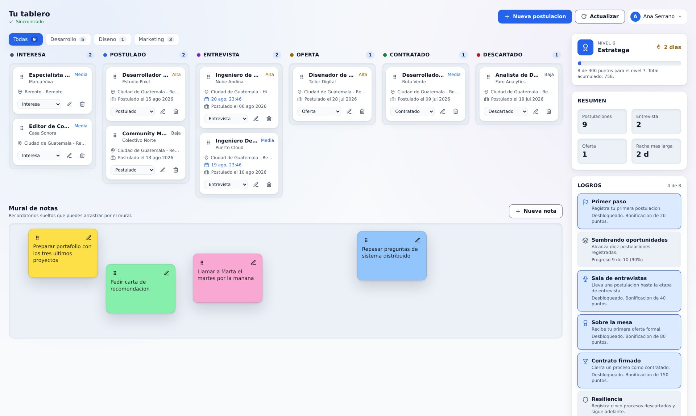

## Que incluye

- **Tablero kanban** con seis estados y arrastre de tarjetas entre columnas.
- **Areas del tablero** con nombre libre (desarrollo, marketing, lo que
  necesites) y un selector para ver una a la vez.
- **Mural de notas adhesivas** con arrastre libre, cinco colores y posicion que
  se conserva entre dispositivos.
- **Captura manual** de empresa, puesto, ubicacion, modalidad, prioridad,
  expectativa salarial, enlace, notas y fechas de postulacion y entrevista.
- **Capa de juego**: experiencia, niveles con rango, racha diaria y ocho logros.
- **Ocho temas visuales** y **dos paquetes de iconos** SVG intercambiables, con
  una capa de profundidad propia por tema (superficies hundidas, sombras y fondo).
- **Sincronizacion en vivo** por WebSockets entre todos los dispositivos de la
  misma cuenta.
- **Tutorial guiado** la primera vez, que atenua la pantalla y destaca donde
  pulsar.
- **Musica ambiental opcional**, sintetizada en el navegador y distinta segun el
  tema.

## Capturas

### Temas

El mismo tablero cambia por completo de personalidad sin tocar el markup: cada
tema redefine el mismo conjunto de variables CSS.

| Oscuro | Galaxy |
| --- | --- |
| 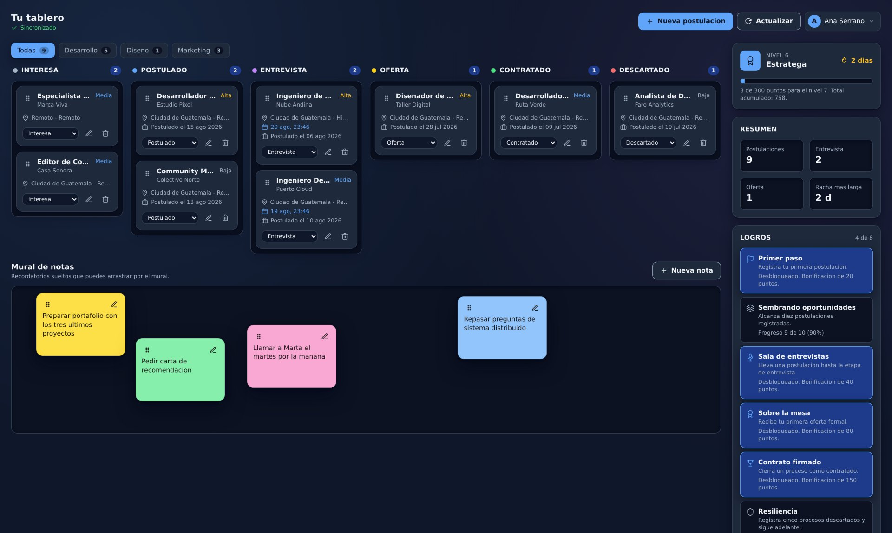 | 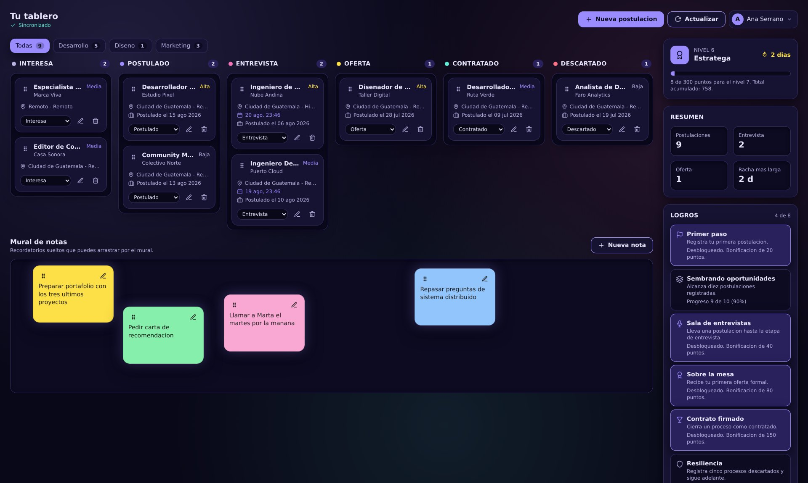 |

| Pixel rosa (con iconos pixel) | Gaming |
| --- | --- |
| 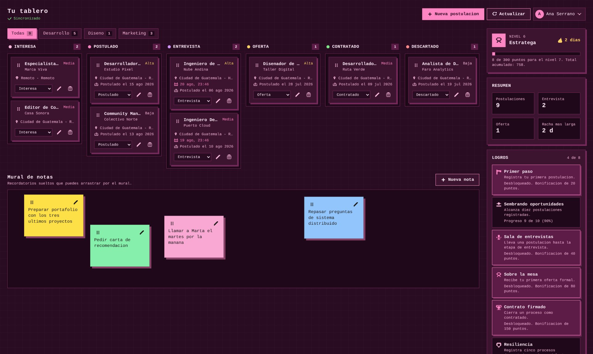 | 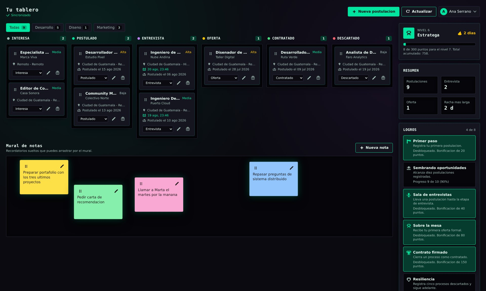 |

### Areas y mural de notas

Sobre el tablero, una pestana por area (con nombre libre) filtra lo que se ve sin
tocar el progreso. Debajo, el mural recoge los recordatorios sueltos: se
arrastran con el raton, con el dedo o con el teclado, y su posicion se guarda en
proporcion al mural, asi que se conserva al cambiar de dispositivo.

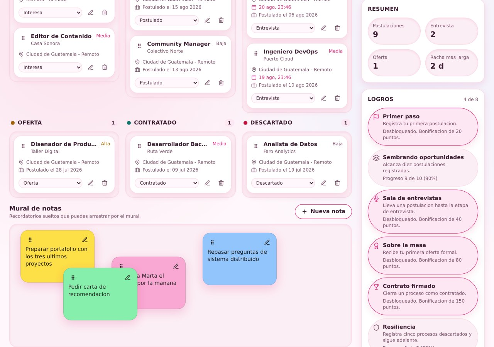

### Tutorial de bienvenida

Mientras el tablero este vacio, un recorrido de cuatro pasos desenfoca el resto
de la interfaz y deja nitido solo el elemento que hay que usar. Se puede saltar
en cualquier momento y no vuelve a aparecer.

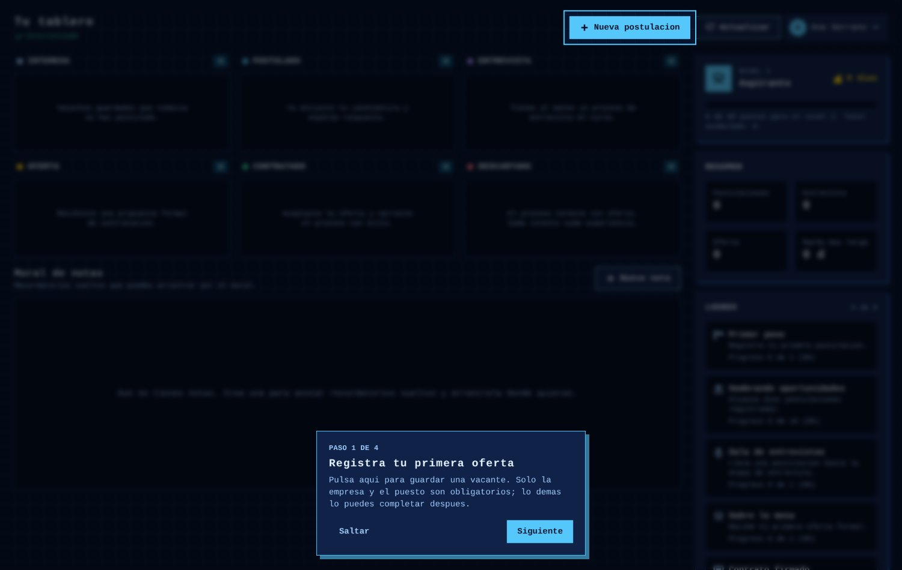

### Selector de apariencia

Ocho temas agrupados en familias, dos paquetes de iconos con vista previa y el
interruptor de musica ambiental.

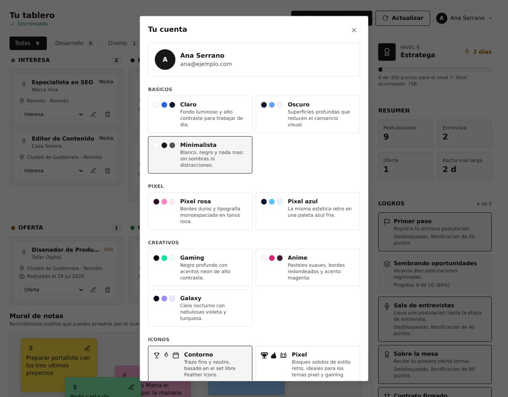

### Movil

En pantallas pequenas las columnas se apilan y el panel de progreso sube al
inicio. El selector de estado de cada tarjeta sustituye al arrastre.

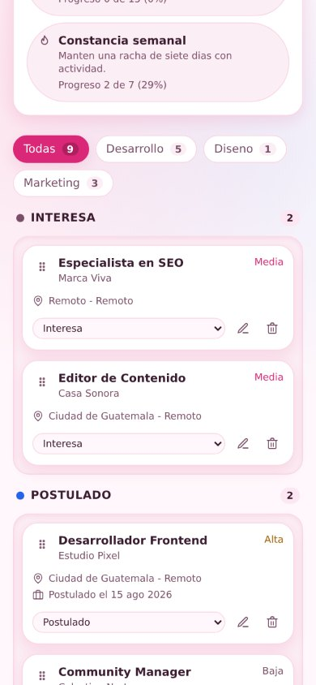

### Bienvenida y acceso

| Pagina de inicio | Inicio de sesion |
| --- | --- |
| 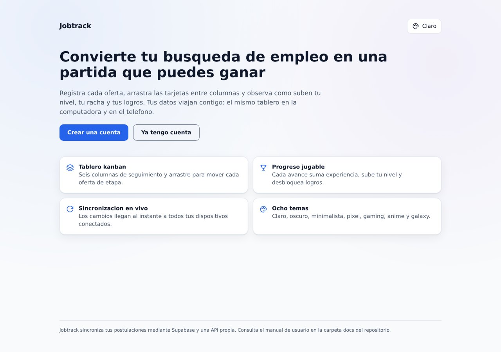 | 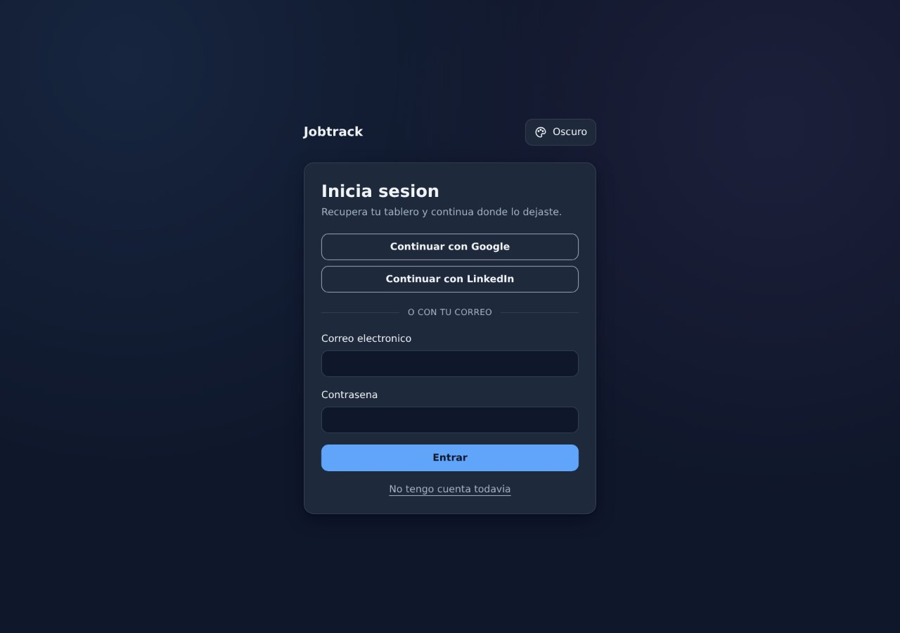 |

## Arquitectura

```
Jobtrack/
  apps/
    api/                 API NestJS 10 (REST + WebSockets)
    web/                 Interfaz Next.js 14 (App Router) + Tailwind CSS 3
  packages/
    contracts/           Tipos y reglas de dominio compartidos
  supabase/
    schema.sql           Esquema PostgreSQL con RLS
  docs/
    MANUAL_USUARIO.md    Guia paso a paso
    MANUAL_TECNICO.md    Arquitectura, modulos y convenciones
    PLAN_DE_PRUEBAS.md   Casos, restricciones y resultados esperados
    capturas/            Imagenes de este README
```

Las reglas de dominio viven en `packages/contracts` y las consumen tanto la API
como la web. Gracias a eso el reordenamiento optimista del navegador y el que
persiste el servidor invocan la **misma** funcion, asi que no pueden divergir.

El detalle de cada modulo esta en [`docs/MANUAL_TECNICO.md`](docs/MANUAL_TECNICO.md).

## Stack

| Capa | Tecnologia |
| --- | --- |
| Interfaz | Next.js 14 (App Router), React 18, TypeScript, Tailwind CSS 3 |
| Arrastre | dnd-kit (puntero y teclado) |
| API | NestJS 10, class-validator, Socket.IO, Helmet |
| Autenticacion | Supabase Auth: Google, LinkedIn y correo con contrasena; JWT verificado en la API |
| Base de datos | PostgreSQL 15 gestionado por Supabase, con Row Level Security |
| Pruebas | Vitest y Testing Library en la web, Jest y Supertest en la API |

## Puesta en marcha

Requisitos: Node.js 20 o superior.

```bash
npm install
cp apps/api/.env.example apps/api/.env
cp apps/web/.env.example apps/web/.env.local
```

Arranca los dos procesos en terminales separadas:

```bash
npm run dev:api    # http://localhost:4000/api
npm run dev:web    # http://localhost:3000
```

Con la configuracion de ejemplo la API usa el driver `memory`, asi que arranca
sin credenciales externas. Para persistir en PostgreSQL, ejecuta
`supabase/schema.sql` en tu proyecto de Supabase y completa en `apps/api/.env`:

```
DATA_DRIVER=supabase
SUPABASE_URL=https://<proyecto>.supabase.co
SUPABASE_SERVICE_ROLE_KEY=<clave de servicio>
```

El esquema se puede volver a ejecutar entero sobre un proyecto que ya existe:
tipos, tablas, indices y politicas se crean solo si faltan, y las columnas
anadidas despues se aplican al final con `alter table ... add column if not exists`.

La API verifica los tokens con las claves publicas del proyecto (`SUPABASE_URL`),
asi que no hace falta ningun secreto de firma. Solo los proyectos que aun usan el
esquema heredado HS256 necesitan ademas `SUPABASE_JWT_SECRET`.

Y en `apps/web/.env.local`:

```
NEXT_PUBLIC_API_URL=http://localhost:4000/api
NEXT_PUBLIC_SUPABASE_URL=https://<proyecto>.supabase.co
NEXT_PUBLIC_SUPABASE_ANON_KEY=<clave publica>
```

## Comandos

| Comando | Efecto |
| --- | --- |
| `npm run build` | Compila el paquete compartido, la API y la web |
| `npm test` | Ejecuta las suites de los tres paquetes |
| `npm run test:unit` | Solo pruebas unitarias |
| `npm run test:integration` | Solo pruebas de integracion |
| `npm run lint` | Analisis estatico de la API y la web |

## Pruebas

314 casos, todos en verde y sin dependencias de red externas:

| Paquete | Herramienta | Casos |
| --- | --- | --- |
| `contracts` | Vitest | 74 |
| `api` | Jest y Supertest | 81 |
| `web` | Vitest y Testing Library | 159 |

Cubren las restricciones del plan: ausencia de conexion, valores nulos, datos
corruptos y sincronizacion entre dispositivos. Las pruebas de tiempo real
levantan la API en un puerto real y usan clientes `socket.io` autenticos. El
desglose completo esta en [`docs/PLAN_DE_PRUEBAS.md`](docs/PLAN_DE_PRUEBAS.md).

## Despliegue

### Web en Vercel

Al importar el repositorio, en **Settings -> General**:

| Ajuste | Valor |
| --- | --- |
| Root Directory | `apps/web` |
| Include files outside the root directory | **Activado** |
| Framework Preset | Next.js (se detecta solo) |
| Build Command | por defecto (`npm run build`) |

El **Root Directory debe apuntar a `apps/web`**, no a la raiz: Vercel busca la
dependencia `next` en el `package.json` de ese directorio, y el de la raiz solo
declara los workspaces. La casilla de archivos externos es obligatoria porque la
web compila `packages/contracts` antes de construirse.

Variables de entorno del proyecto:

```
NEXT_PUBLIC_API_URL=https://<tu-api>/api
NEXT_PUBLIC_SUPABASE_URL=https://<proyecto>.supabase.co
NEXT_PUBLIC_SUPABASE_ANON_KEY=<clave publica>
```

Sin ellas la aplicacion despliega igual y muestra un aviso explicando que falta
configurar Supabase, pero no permite iniciar sesion.

### Autenticacion en produccion

En **Authentication -> URL Configuration** del proyecto de Supabase:

| Campo | Valor |
| --- | --- |
| Site URL | El dominio publico de la web |
| Redirect URLs | `https://<dominio>/**` |

Para habilitar los accesos externos, en **Authentication -> Providers** pega el
identificador y el secreto de cada aplicacion OAuth. En todas ellas el URI de
redireccion autorizado es `https://<proyecto>.supabase.co/auth/v1/callback`.

| Proveedor de Supabase | Donde se crea la aplicacion |
| --- | --- |
| Google | Google Cloud, apartado de credenciales OAuth |
| LinkedIn (OIDC) | LinkedIn Developers, producto *Sign In with LinkedIn using OpenID Connect* |

El servicio de correo integrado de Supabase esta pensado para desarrollo y
limita los envios por hora. Un despliegue real que use registro por correo
necesita un **SMTP propio** configurado en *Project Settings -> Authentication*.

### API en Render

El repositorio incluye `render.yaml`, asi que basta con **New -> Blueprint** y
seleccionar el repositorio. Render pedira tres valores al crear el servicio:
`SUPABASE_URL`, `SUPABASE_SERVICE_ROLE_KEY` y `CORS_ORIGINS` (el dominio publico
de la web).

La API es un proceso persistente con WebSockets, asi que no encaja en las
funciones serverless de Vercel: necesita un servicio con proceso continuo.

Para cualquier otro proveedor, los comandos son:

```bash
npm install --include=dev   # NODE_ENV=production omitiria TypeScript y la CLI de Nest
npm run build --workspace @jobtrack/api
npm run start:prod --workspace @jobtrack/api
```

La sonda de disponibilidad es `GET /api/health`.

## Convenciones de codigo

- TypeScript estricto en los tres paquetes.
- Sin emojis en el codigo ni en la interfaz; la iconografia es SVG vectorial
  (ver [`apps/web/src/components/icons/ICONS_LICENSE.md`](apps/web/src/components/icons/ICONS_LICENSE.md)).
- Una sola fuente por regla: si una logica se necesita en la API y en la web,
  vive en `@jobtrack/contracts`.

## Licencia

MIT.
